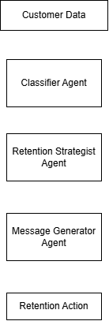

🛒 **Ecommerce Retention Agent**

AI-powered customer retention workflow built with Lyzr

Identify → Decide → Personalize

💡 The Idea

Ecommerce teams don't need to message every customer.

This workflow identifies who needs attention, decides what action to take, and generates what to say.

⚙️ How It Works

Customer Data → Classify → Strategize → Personalize

📊 Agent 1 — Customer Classifier
Identifies customer risk using purchase behavior, spend and inactivity.

🎯 Agent 2 — Retention Strategist
Determines the appropriate action, channel and urgency.

✉️ Agent 3 — Message Generator
Creates personalized re-engagement messaging based on the strategy.

Architecture

 

🧪 Example

Aman — C035

48 days inactive · ₹45,000 spend · Luxury Watches

↓

High-Value At-Risk

↓

High-Value Retention · Email · Critical

↓

Personalized re-engagement message

🛠️ Tech Stack

Lyzr · LLMs · Prompt Engineering · Multi-Agent Workflows · Structured JSON

📊 Evaluation

Tested with 50 synthetic customer profiles, including:

Normal customer behavior
30/60-day boundary cases
High-value customers
Low-frequency / high-spend customers
Inconsistent data

Validated classification, strategy selection, structured outputs and message personalization.

🚀 Future

Email automation → CRM integration → Campaign analytics
